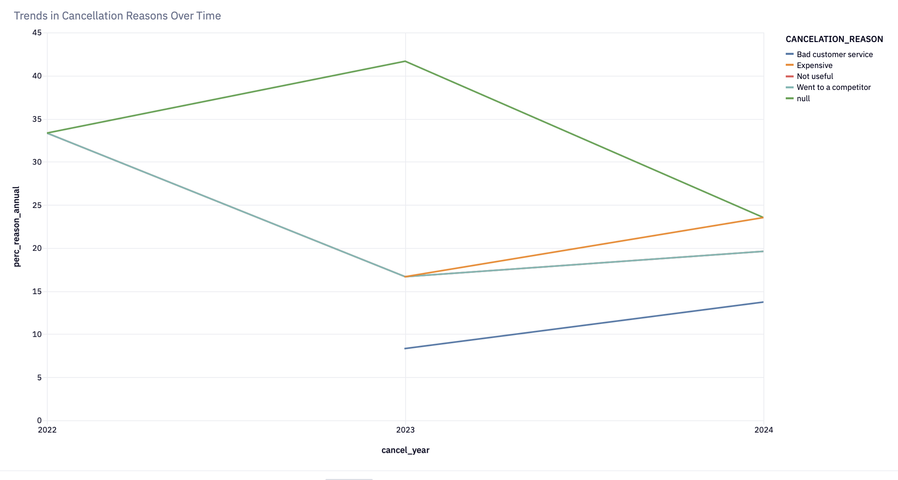

# Subscription Cancellation Analysis (Project 2)

🔗 **Live Interactive Notebook (Hex):**  
https://app.hex.tech/big-sql-energy/hex/Project-2-Subscription-Cancelation-Analysis-031ZabB9FpDxlB76dWHmJ0/draft/logic

## Executive Summary

The company is experiencing elevated subscription churn with material revenue implications. Leadership has requested a deeper understanding of why users are canceling in order to inform data-driven retention strategies. This analysis leverages user-reported cancellation reasons to uncover key churn drivers, identify trends over time, and generate actionable recommendations to improve retention.

---

## Business Problem

The company is experiencing elevated subscription churn with a material negative impact on revenue. However, there is currently limited visibility into why users are canceling. To address this gap, the analytics team will analyze user-reported cancellation data from the product’s cancellation workflow to identify churn patterns, understand the primary and secondary drivers of churn, and inform data-driven retention efforts.

---

## Why this analysis matters

Without a clear understanding of why users are canceling, retention initiatives risk addressing symptoms rather than root causes. By leveraging structured user-reported cancellation data, this analysis enables the company to prioritize retention efforts around the highest-impact churn drivers and allocate resources more effectively.

---

## Cancellation Reasons by Reason Order

The chart illustrates user-reported cancellation reasons by reason order, showing what users cite as their primary, secondary, and tertiary drivers of churn. The most common primary reasons include “Not useful,” “Expensive,” and “Went to a competitor,” suggesting multiple contributing factors behind cancellation decisions. The noticeable drop-off in responses after the first reason indicates limited visibility into secondary drivers of churn. This highlights a gap in understanding how cancellation reasons compound, motivating deeper analysis into churn drivers. These insights provide a data-backed foundation for prioritizing retention initiatives with the highest potential revenue impact.

---

## Methodology

- EDA  
- Product Funnel Analysis  
- Data Visualization  

---

## Skills

- Data Analysis: SQL (CTEs, CASE, UNION, Views), Exploratory Data Analysis  
- Data Visualization & Reporting: Data visualization, Data Science notebooks  
- Data Engineering & Warehousing: Snowflake, data cleaning and wrangling  

---

# Results & Business Recommendation

## Results

### 1. How many users select additional cancellation reasons?

A large majority of users selected at least one additional cancellation reason beyond the required first reason, indicating that churn decisions are typically driven by multiple contributing factors rather than a single issue. However, the number of users providing a third cancellation reason drops significantly, suggesting reduced engagement as additional input is required and limited value from collecting more than two reasons.

---

### 2. What is the primary (first) cancellation reason?

As a primary cancellation reason:

- ~36% of users cited “Not useful”
- ~32% cited “Expensive”
- ~27% cited “Went to a competitor”
- ~5% cited “Bad customer service”

This indicates that perceived lack of product value is the strongest initial driver of churn, followed closely by pricing concerns and competitive alternatives.

---

### 3. How have cancellation reasons changed over time?

Over time, cancellations attributed to pricing (“Expensive”) increase steadily, rising from earlier years to the most recent period. In contrast, “Not useful” declines after 2023, suggesting that product value concerns are becoming less dominant relative to pricing sensitivity. “Went to a competitor” remains relatively stable across years, indicating sustained competitive pressure rather than a short-term shift.

---

### 4. Additional insights from the analysis

Across all users and cancellation reason selections, pricing (“Expensive”) and competition (“Went to a competitor”) together account for ~59% of all cited cancellation reasons, making them the most dominant drivers of churn overall. This indicates that external market factors and price sensitivity outweigh internal issues such as customer support in influencing cancellation behavior.

“Not useful” accounts for ~28% of cancellation reasons, suggesting that perceived lack of value remains a meaningful contributor, but often appears alongside pricing or competitive concerns rather than as a standalone issue. In contrast, customer service-related reasons represent only ~13%, indicating that support issues are a relatively minor driver of churn in comparison.

---

# Business Recommendations

- Improve early onboarding and in-product guidance to help users realize value faster.
- Introduce targeted cancellation rescue offers for price-sensitive users.
- Conduct regular competitive analysis to maintain strong market positioning.
- Use cancellation reason data to segment users and personalize retention strategies.
- A/B test retention initiatives and track changes in cancellation reasons over time.

---

# Next Steps

- Analyze product engagement patterns of canceled users, including feature usage, frequency, and recency, and compare them against retained users to identify behavioral signals associated with churn.
- Identify high-impact features that correlate with retention and assess whether canceled users failed to activate or adopt these features.
- Partner with product management to iterate on the cancellation workflow, testing targeted rescue tactics and thoughtful friction points that encourage retention without increasing user frustration.
